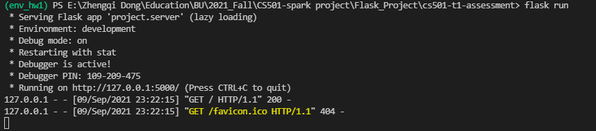
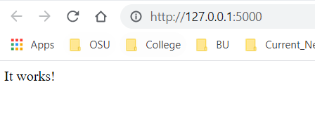
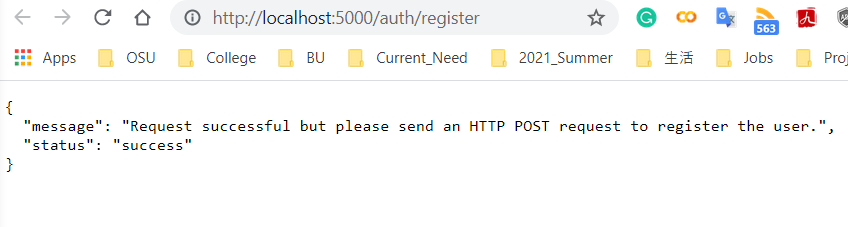
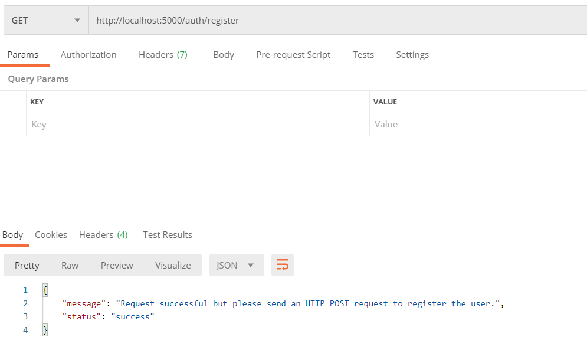

# Flask JWT Auth

## Quick Start

### Basics Setup
- Activate a virtualenv
- Install the requirements

```bash
py -m venv env_hw1
.\env_hw1\Scripts\activate
py -m pip install -r requirements.txt
```
- Rerefence
  - Installation, How to installing using pip and virtual env, https://packaging.python.org/guides/installing-using-pip-and-virtual-environments/


If there are package that is not working, just skip them, and get all unbroken packages installed. And, then you go to each file, and find any unresolved package, and install them manually.

### Set Environment Variables

Update *project/server/config.py*, and then run:

For Linux:
```sh
$ export FLASK_APP=project.server
$ export APP_SETTINGS="project.server.config.DevelopmentConfig"
# $ export APP_SETTINGS="project.server.config.ProductionConfig"
```

For Windows(powershell):
```bash
$env:FLASK_ENV = "development"
$env:FLASK_APP = "project.server"
flask db init
flask db migrate
flask db upgrade
flask run --host=localhost --port=5001
```

Create the tables and run the migrations:

```sh
$ flask db init
$ flask db migrate
$ flask db upgrade
```

### Run the Application

```sh
$ flask run
```

So access the application at the address [http://localhost:5000/](http://localhost:5000/)

> Want to specify a different port?

> ```sh
> $ flask run --host=0.0.0.0 --port=5000
> ```

At the end you should have a window like this:



And, if you open an window at that default 5000 port address, you should see something like this:



We can open a browser, to verify the app is working:



Or with postman:




## Send an HTTP POST request

Goal: Next send an HTTP POST request to http://localhost:5000/auth/register and create a new user with an email and password.

### [How To Process Incoming Request Data in Flask](https://www.digitalocean.com/community/tutorials/processing-incoming-request-data-in-flask)

There are three way to send a HTTP post quest, and the way to handle those request are also different in terms of format.

### Using Query Argument

------

URL arguments that you add to a query string are a common way to pass data to a web app. While browsing the web, you will have likely encountered a query string before.

A query string resembles the following:

```
example.com?arg1=value1&arg2=value2
```

The query string begins after the question mark (`?`) character:

```
example.com?arg1=value1&arg2=value2
```

And has key-value pairs separated by an ampersand (`&`) character:

```
example.com?arg1=value1&arg2=value2
```

For each pair, the key is followed by an equals sign (`=`) character and then the value.

```
arg1 : value1
arg2 : value2
```

Query strings are useful for passing data that does not require the user to take action. You could generate a query string somewhere in your app and append it to a URL so when a user makes a request, the data is automatically passed for them. A query string can also be generated by forms that have GET as the method.

Let’s add a query string to the `query-example` route. In this hypothetical example, you will provide the name of a programming language that will be displayed on the screen. Create a key of `"language"` and a value of `"Python"`:

```
http://127.0.0.1:5000/query-example?language=Python
```

If you run the app and navigate to that URL, you will see that it still displays a message of `"Query String Example"`.

You will need to program the part that handles the query arguments. This code will read in the `language` key by using either `request.args.get('language')` or `request.args['language']`.

By calling `request.args.get('language')`, the application will continue to run if the `language` key doesn’t exist in the URL. In that case, the result of the method will be `None`.

By calling `request.args['language']`, the app will return a 400 error if the `language` key doesn’t exist in the URL.

When dealing with query strings, it is recommended to use `request.args.get()` to prevent the app from failing.

Let’s read the `language` key and display it as output.

Modify the `query-example` route in `app.py` with the following code:

app.py

```python
@app.route('/query-example')
def query_example():
    # if key doesn't exist, returns None
    language = request.args.get('language')

    return '''<h1>The language value is: {}</h1>'''.format(language)
```

 

Copy

Then, run the app and navigate to the URL:

```
http://127.0.0.1:5000/query-example?language=Python
```

The browser should display the following message:

```
OutputThe language value is: Python
```

The argument from the URL gets assigned to the `language` variable and then gets returned to the browser.

To add more query string parameters, you can append ampersands and the new key-value pairs to the end of the URL. Create a key of `"framework"` and a value of `"Flask"`:

```
http://127.0.0.1:5000/query-example?language=Python&framework=Flask
```

And if you want more, continue adding ampersands and key-value pairs. Create a key of `"website"` and a value of `"DigitalOcean"`:

```
http://127.0.0.1:5000/query-example?language=Python&framework=Flask&website=DigitalOcean
```

To gain access to those values, you will still use either `request.args.get()` or `request.args[]`. Let’s use both to demonstrate what happens when there is a missing key. Modify the `query_example` route to assign the value of the results to variables and then display them:

```python
@app.route('/query-example')
def query_example():
    # if key doesn't exist, returns None
    language = request.args.get('language')

    # if key doesn't exist, returns a 400, bad request error
    framework = request.args['framework']

    # if key doesn't exist, returns None
    website = request.args.get('website')

    return '''
              <h1>The language value is: {}</h1>
              <h1>The framework value is: {}</h1>
              <h1>The website value is: {}'''.format(language, framework, website)
```

 

Copy

Then, run the app and navigate to the URL:

```
http://127.0.0.1:5000/query-example?language=Python&framework=Flask&website=DigitalOcean
```

The browser should display the following message:

```
OutputThe language value is: Python
The framework value is: Flask
The website value is: DigitalOcean
```

Remove the `language` key from the URL:

```
http://127.0.0.1:5000/query-example?framework=Flask&website=DigitalOcean
```

The browser should display the following message with `None` when a value is not provided for `language`:

```
OutputThe language value is: None
The framework value is: Flask
The website value is: DigitalOcean
```

Remove the `framework` key from the URL:

```
http://127.0.0.1:5000/query-example?language=Python&website=DigitalOcean
```

The browser should encounter an error because it is expecting a value for `framework`:

```
Outputwerkzeug.exceptions.BadRequestKeyError
werkzeug.exceptions.BadRequestKeyError: 400 Bad Request: The browser (or proxy) sent a request that this server could not understand.
KeyError: 'framework'
```

Now you understand handling query strings. Let’s continue to the next type of incoming data.

### Using Form Data

------

Form data comes from a form that has been sent as a POST request to a route. So instead of seeing the data in the URL (except for cases when the form is submitted with a GET request), the form data will be passed to the app behind the scenes. Even though you cannot easily see the form data that gets passed, your app can still read it.

To demonstrate this, modify the `form-example` route in `app.py` to accept both GET and POST requests and returns a form:

app.py

```python
# allow both GET and POST requests
@app.route('/form-example', methods=['GET', 'POST'])
def form_example():
    return '''
              <form method="POST">
                  <div><label>Language: <input type="text" name="language"></label></div>
                  <div><label>Framework: <input type="text" name="framework"></label></div>
                  <input type="submit" value="Submit">
              </form>'''
```

 

Copy

Then, run the app and navigate to the URL:

```
http://127.0.0.1:5000/form-example
```

The browser should display a form with two input fields - one for `language` and one for `framework` - and a submit button.

The most important thing to know about this form is that it performs a POST request to the same route that generated the form. The keys that will be read in the app all come from the `name` attributes on our form inputs. In this case, `language` and `framework` are the names of the inputs, so you will have access to those in the app.

Inside the view function, you will need to check if the request method is GET or POST. If it is a GET request, you can display the form. Otherwise, if it is a POST request, then you will want to process the incoming data.

Modify the `form-example` route in `app.py` with the following code:

app.py

```python
# allow both GET and POST requests
@app.route('/form-example', methods=['GET', 'POST'])
def form_example():
    # handle the POST request
    if request.method == 'POST':
        language = request.form.get('language')
        framework = request.form.get('framework')
        return '''
                  <h1>The language value is: {}</h1>
                  <h1>The framework value is: {}</h1>'''.format(language, framework)

    # otherwise handle the GET request
    return '''
           <form method="POST">
               <div><label>Language: <input type="text" name="language"></label></div>
               <div><label>Framework: <input type="text" name="framework"></label></div>
               <input type="submit" value="Submit">
           </form>'''
```

 

Copy

Then, run the app and navigate to the URL:

```
http://127.0.0.1:5000/form-example
```

Fill out the `language` field with value of `Python` and the `framework` field with the value of `Flask`. Then, press **Submit**.

The browser should display the following message:

```
OutputThe language value is: Python
The framework value is: Flask
```

Now you understand handling form data. Let’s continue to the next type of incoming data.

### Using JSON Data

------

JSON data is normally constructed by a process that calls the route.

An example JSON object looks like this:

```json
{
    "language" : "Python",
    "framework" : "Flask",
    "website" : "Scotch",
    "version_info" : {
        "python" : "3.9.0",
        "flask" : "1.1.2"
    },
    "examples" : ["query", "form", "json"],
    "boolean_test" : true
}
```

 

Copy

This structure can allow for much more complicated data to be passed as opposed to query strings and form data. In the example, you see nested JSON objects and an array of items. Flask can handle this format of data.

Modify the `form-example` route in `app.py` to accept POST requests and ignore other requests like GET:

app.py

```python
@app.route('/json-example', methods=['POST'])
def json_example():
    return 'JSON Object Example'
```

 

Copy

Unlike the web browser used for query strings and form data, for the purposes of this article, to send a JSON object, you will use [Postman](https://www.getpostman.com/) to send custom requests to URLs.

**Note**: If you need assistance navigating the Postman interface for requests, consult [the official documentation](https://learning.postman.com/docs/postman/sending-api-requests/requests/).

In Postman, add the URL and change the type to **POST**. On the body tab, change to **raw** and select **JSON** from the drop-down.

These settings are required so Postman can send JSON data properly, and so your Flask app will understand that it is receiving JSON:

```
POST http://127.0.0.1:5000/json-example
Body
raw JSON
```

Next, copy the earlier JSON example into the text input.

Send the request, and you should get `"JSON Object Example"` as the response. That is fairly anti-climatic but is to be expected because the code for handling the JSON data response has yet to be written.

To read the data, you must understand how Flask translates JSON data into Python data structures:

- Anything that is an object gets converted to a Python dict. `{"key" : "value"}` in JSON corresponds to `somedict['key']`, which returns a value in Python.
- An array in JSON gets converted to a list in Python. Since the syntax is the same, here’s an example list: `[1,2,3,4,5]`
- The values inside of quotes in the JSON object become strings in Python.
- Boolean `true` and `false` become `True` and `False` in Python.
- Finally, numbers without quotes around them become numbers in Python.

Now let’s work on the code to read the incoming JSON data.

First, let’s assign everything from the JSON object into a variable using `request.get_json()`.

`request.get_json()` converts the JSON object into Python data. Let’s assign the incoming request data to variables and return them by making the following changes to the `json-example` route:

app.py

```python
# GET requests will be blocked
@app.route('/json-example', methods=['POST'])
def json_example():
    request_data = request.get_json()

    language = request_data['language']
    framework = request_data['framework']

    # two keys are needed because of the nested object
    python_version = request_data['version_info']['python']

    # an index is needed because of the array
    example = request_data['examples'][0]

    boolean_test = request_data['boolean_test']

    return '''
           The language value is: {}
           The framework value is: {}
           The Python version is: {}
           The item at index 0 in the example list is: {}
           The boolean value is: {}'''.format(language, framework, python_version, example, boolean_test)
```

 

Copy

Note how you access elements that aren’t at the top level. `['version']['python']` is used because you are entering a nested object. And `['examples'][0]` is used to access the 0th index in the examples array.

If the JSON object sent with the request doesn’t have a key that is accessed in your view function, then the request will fail. If you don’t want it to fail when a key doesn’t exist, you’ll have to check if the key exists before trying to access it.

app.py

```python
# GET requests will be blocked
@app.route('/json-example', methods=['POST'])
def json_example():
    request_data = request.get_json()

    language = None
    framework = None
    python_version = None
    example = None
    boolean_test = None

    if request_data:
        if 'language' in request_data:
            language = request_data['language']

        if 'framework' in request_data:
            framework = request_data['framework']

        if 'version_info' in request_data:
            if 'python' in request_data['version_info']:
                python_version = request_data['version_info']['python']

        if 'examples' in request_data:
            if (type(request_data['examples']) == list) and (len(request_data['examples']) > 0):
                example = request_data['examples'][0]

        if 'boolean_test' in request_data:
            boolean_test = request_data['boolean_test']

    return '''
           The language value is: {}
           The framework value is: {}
           The Python version is: {}
           The item at index 0 in the example list is: {}
           The boolean value is: {}'''.format(language, framework, python_version, example, boolean_test)
```

 

Copy

Run the app and submit the example JSON request using Postman. In the response, you will get the following output:

```
OutputThe language value is: Python
The framework value is: Flask
The Python version is: 3.9
The item at index 0 in the example list is: query
The boolean value is: false
```

Now you understand handling JSON objects.

